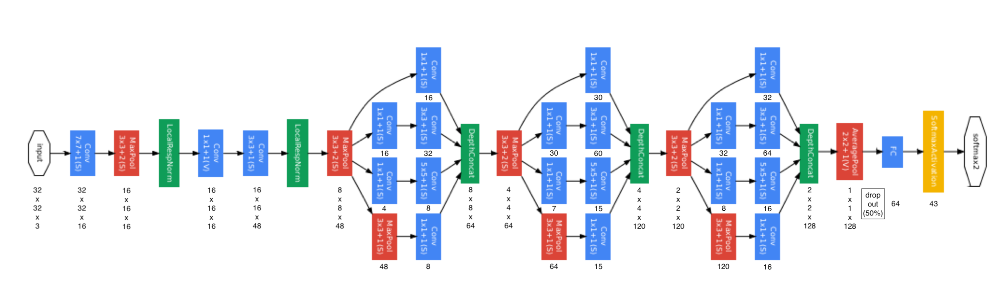
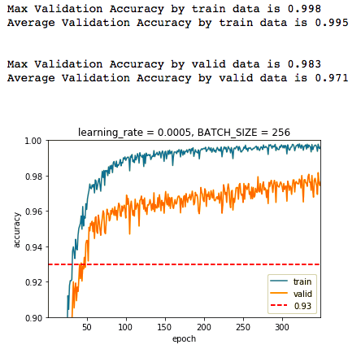

# **Traffic Sign Recognition**

---

## 1. Architecture

This is improved version of [my CarND-Traffic-Sign-Classifier-Project](https://github.com/Hotsuyuki/CarND-Traffic-Sign-Classifier-Project/blob/master/writeup.md). The dataset is the  [German Traffic Signs](https://d17h27t6h515a5.cloudfront.net/topher/2017/February/5898cd6f_traffic-signs-data/traffic-signs-data.zip) as well.

I remodeled the architecture of convolutional neural networks from scratch using simple [inception module](https://www.youtube.com/watch?v=VxhSouuSZDY), which is used in Google's ConvNets.

Based on [GoogLeNet](https://www.cs.unc.edu/~wliu/papers/GoogLeNet.pdf), I made the new neural networks architecture as follows:

The new architecture using inception module  

## 2. Result

The hyperparameters I used are:

| Name            | Value  | Description                                       |
|:---------------:|:------:|:-------------------------------------------------:|
| `mu`            | 0      | For initilazing Wights with normal distribution   |
| `sigma`         | 0.01   | For initilazing Wights with normal distribution   |
| `learning_rate` | 0.0005 | For training neural networks                      |
| `epochs`        | 350    | Number of training times                          |
| `BATCH_SIZE`    | 256    | Number of images feeding to the model at one time |

After training, the validation accuracy of new architecture is:

The validation accuracy of new architecture  

That shows the new convolutional neural networks using inception module improved the max validation accuracy from [97.3](https://github.com/Hotsuyuki/CarND-Traffic-Sign-Classifier-Project/blob/master/writeup_images/learning_rate%3D0.001%2C%20BATCH_SIZE%3D256.png)% to **98.3**%.
